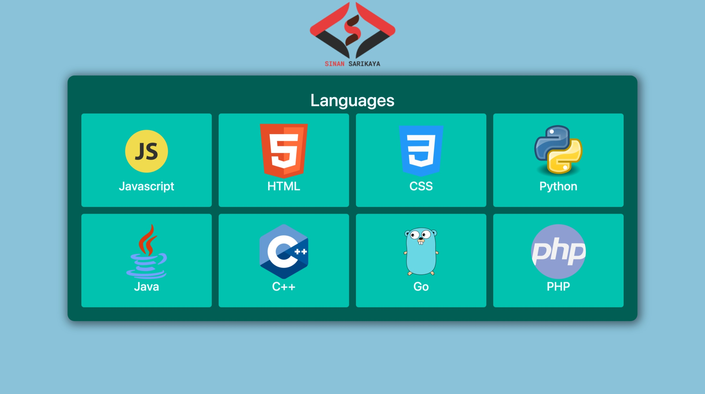

# React Language Cards


Responsive language cards system made using React

<hr />

### Installation Options

```
$ git clone https://github.com/sinansarikaya/react-language-cards.git
```

```
$ npm install
```

```
$ npm start
```

### Or

```
$ git clone https://github.com/sinansarikaya/react-language-cards.git
```

```
$ yarn
```

```
$ yarn start
```

<hr />

### Demo

#### [View Demo](https://sinansarikaya.github.io/react-language-cards/)



<hr />
